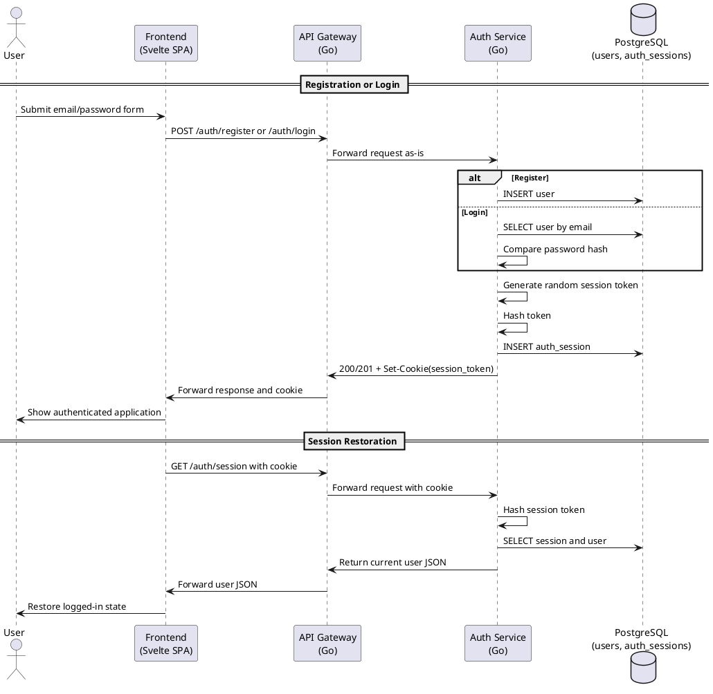

# Interaction Diagrams

## Overview

This document contains sequence-style descriptions of the two main runtime
flows implemented in the repository today:

1. local email/password authentication
2. authenticated diabetes-risk prediction

## Use Case 1: Local Authentication Flow

### Description

This flow covers account registration or login, session creation, and later
session restoration through `GET /auth/session`.

### Sequence Diagram (PlantUML)



## Use Case 2: Authenticated Risk Prediction Flow

### Description

This flow covers submission of the 21-feature form, session validation in
the gateway, forwarding to the ML service, and rendering of the result in
the frontend.

### Sequence Diagram (PlantUML)

```plantuml
@startuml
actor User
participant "Frontend\n(Svelte SPA)" as Frontend
participant "API Gateway\n(Go)" as Gateway
participant "Auth Service\n(Go)" as AuthSvc
participant "ML Service\n(FastAPI)" as MLService

== User Fills Form ==
User -> Frontend: Enter 21 health indicators
User -> Frontend: Click "Estimate Risk"

== Session Validation ==
Frontend -> Gateway: POST /api/risk with session_token cookie
Gateway -> Gateway: Read session_token cookie
Gateway -> AuthSvc: GET /auth/session with cookie

alt Session valid
    AuthSvc -> Gateway: 200 OK + user JSON
else Session invalid
    AuthSvc -> Gateway: 401 Unauthorized
    Gateway -> Frontend: 401 Unauthorized
    Frontend -> User: Return to auth flow
    stop
end

== Prediction ==
Gateway -> Gateway: Normalize request to {features: {...}}
Gateway -> MLService: POST /predict
MLService -> MLService: Load joblib artifact
MLService -> MLService: Validate feature names
MLService -> MLService: Build feature vector
MLService -> MLService: Run model inference
MLService -> Gateway: Prediction payload
Gateway -> Frontend: Prediction payload

== Result Rendering ==
Frontend -> Frontend: Format RiskPercent * 100
Frontend -> User: Display percentage, category, and message

@enduml
```

## Notes

- the current runtime flow uses email/password authentication, not Google OAuth
- `api-gateway` performs session validation before forwarding prediction requests
- the current browser flow does not persist prediction results after display
