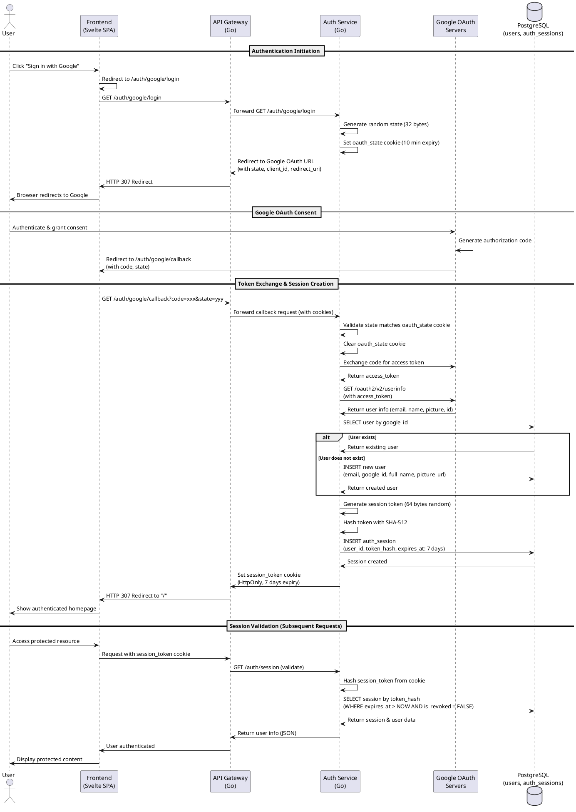
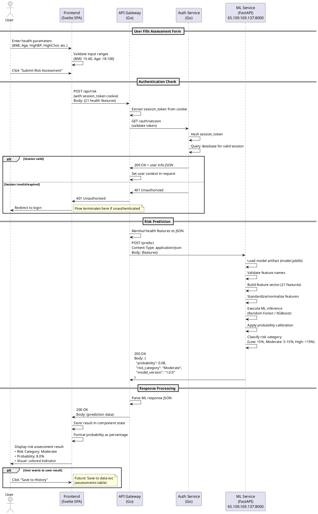

# Interaction Diagrams

## Overview
This document contains the interaction diagrams for the two most complex use cases in the DiabRisk system. These diagrams are modeled as sequence diagrams using PlantUML syntax to illustrate the flow of interactions between system components.

---

## Use Case 1: Google OAuth Authentication Flow
### Description:
This use case models the complete authentication flow when a user signs in with their Google account. It involves multiple redirects, token exchanges, user creation/retrieval, session creation with secure token hashing, and cookie-based session management across multiple microservices.

### Sequence Diagram (PlantUML):

---

## Use Case 2: Diabetes Risk Prediction with ML Service
### Description:
This use case models the complete flow of submitting health assessment data, authentication validation, ML model inference on an external server, and result display. It demonstrates the interaction between frontend, API gateway authentication middleware, and the remote ML prediction service.

### Sequence Diagram (PlantUML):

---

## Diagram Generation Instructions

To generate diagrams from these PlantUML specifications:

1. **Online**: Copy the code block and paste into [PlantUML Online Editor](http://www.plantuml.com/plantuml)
2. **VS Code**: Install the "PlantUML" extension and preview the markdown file
3. **CLI**: Use `plantuml interaction_diagrams.md` to generate PNG/SVG files
4. **Docker**: `docker run -v $(pwd):/data plantuml/plantuml interaction_diagrams.md`

---

## Complexity Analysis

### Use Case 1 Complexity Factors:
- **7 system components** involved (User, Frontend, Gateway, AuthSvc, Google, DB, Cookies)
- **State management** across multiple redirects (oauth_state cookie)
- **Security operations** (token generation, SHA-512 hashing, session validation)
- **Error handling** for invalid states, expired tokens, database failures
- **Asynchronous redirects** through browser navigation
- **Cookie domain/expiry configuration** for session persistence

### Use Case 2 Complexity Factors:
- **Authentication middleware** integration (session validation before processing)
- **External service communication** with remote ML API (network latency, timeouts)
- **Data transformation** (JSON marshaling/unmarshaling, feature vector construction)
- **ML model inference** (loading artifacts, preprocessing, prediction, calibration)
- **Error propagation** from ML service to frontend (connection failures, validation errors)
- **Stateful client-side** result display and formatting